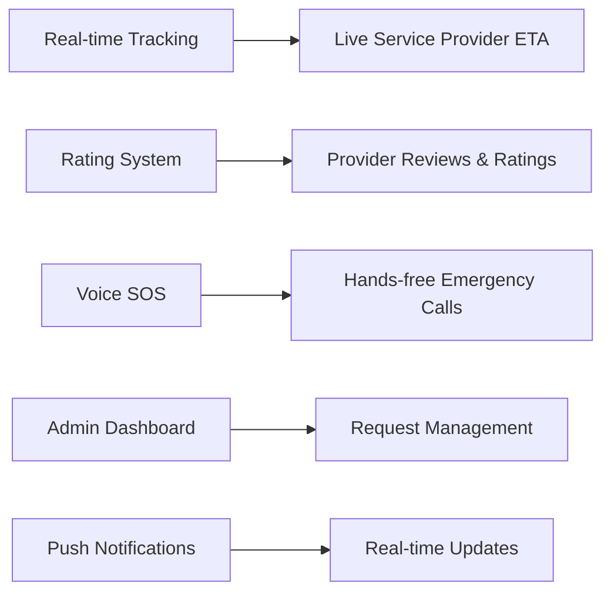

```markdown
<div align="center">

# 🚗 Ride Rescue

### *Your Guardian Angel on the Road*

[](https://ride-rescue-updated.vercel.app)
[](https://youtu.be/fXZ9sKJBNa8?si=qNSx2DskYFHZXZZJ)
[](LICENSE)

**Never get stranded again.** Ride Rescue connects you with certified mechanics and roadside assistance in seconds, turning vehicle emergencies into minor inconveniences.

[🚀 Live Demo](https://ride-rescue-updated.vercel.app) • [📹 Watch Video](https://youtu.be/fXZ9sKJBNa8?si=qNSx2DskYFHZXZZJ) • [🐛 Report Bug](https://github.com/hemvaria/ride-rescue/issues) • [✨ Request Feature](https://github.com/hemvaria/ride-rescue/issues)

</div>

---

## 📖 Table of Contents

- [🎯 What is Ride Rescue?](#-what-is-ride-rescue)
- [✨ Features](#-features)
- [🎥 Demo](#-demo)
- [🛠️ Tech Stack](#️-tech-stack)
- [⚡ Quick Start](#-quick-start)
- [📱 Screenshots](#-screenshots)
- [🗺️ Roadmap](#️-roadmap)
- [🤝 Contributing](#-contributing)
- [👨‍💻 Author](#-author)
- [📄 License](#-license)

---

## 🎯 What is Ride Rescue?

Imagine this: You're driving late at night, miles from home, and suddenly—**your car breaks down**. Panic sets in. Who do you call? Where are you even?

**Enter Ride Rescue** 🦸‍♂️

We're not just another app—we're your **24/7 roadside superhero**. With one tap, connect with certified mechanics, get fuel delivered, or request emergency assistance based on your exact location. No more endless phone calls, no more waiting in the dark.

### 🎯 Perfect For:
- 🌃 Late-night emergencies
- 🛣️ Highway breakdowns
- ⛽ Running out of fuel
- 🔧 Sudden mechanical issues
- 🆘 Any roadside emergency

---

## ✨ Features

<table>
<tr>
<td width="50%">

### 🔧 Instant Mechanic Request
One-tap SOS connects you with **certified mechanics** in your vicinity. No searching, no guessing—just instant help.

</td>
<td width="50%">

### ⛽ Emergency Fuel Delivery
Ran out of gas? We'll bring fuel **directly to you**. Get back on the road without leaving your vehicle.

</td>
</tr>
<tr>
<td width="50%">

### 📍 Smart Location Detection
Advanced **GPS technology** pinpoints your exact location and finds the nearest available service provider—even if you don't know where you are.

</td>
<td width="50%">

### 📱 Mobile-First Design
Sleek, **responsive interface** works flawlessly on any device. Built for real emergencies, optimized for stressed situations.

</td>
</tr>
<tr>
<td width="50%">

### 🚀 Lightning Fast
Requests process in **under 3 seconds**. Because every second counts in an emergency.

</td>
<td width="50%">

### 🔒 Secure & Reliable
Your data is **encrypted** and protected. Only verified service providers access your requests.

</td>
</tr>
</table>

---

## 🎥 Demo

<div align="center">

### 📹 Watch Ride Rescue in Action

[](https://youtu.be/fXZ9sKJBNa8?si=qNSx2DskYFHZXZZJ)

*Click to watch the full demo video*

</div>

---

## 🛠️ Tech Stack

<div align="center">

### Built with Modern Technologies


</div>

| Category | Technologies |
|----------|-------------|
| **Frontend** | Next.js 14, React, TypeScript |
| **Styling** | Tailwind CSS, CSS Modules |
| **Backend** | Supabase (PostgreSQL, Auth, Realtime) |
| **Maps & Location** | Google Maps API / Mapbox |
| **Deployment** | Vercel (CI/CD) |
| **State Management** | React Hooks, Context API |

---

## ⚡ Quick Start

### Prerequisites

```bash
node >= 18.0.0
npm >= 9.0.0
```

### 🚀 Installation

```bash
# 1️⃣ Clone the repository
git clone https://github.com/hemvaria/ride-rescue.git

# 2️⃣ Navigate to project directory
cd ride-rescue

# 3️⃣ Install dependencies
npm install
# or
pnpm install
# or
yarn install
```

### 🔐 Environment Setup

Create a `.env.local` file in the root directory:

```env
# Supabase Configuration
NEXT_PUBLIC_SUPABASE_URL=your_supabase_project_url
NEXT_PUBLIC_SUPABASE_ANON_KEY=your_supabase_anon_key

# Maps API (Google Maps or Mapbox)
NEXT_PUBLIC_MAPS_API_KEY=your_maps_api_key

# Optional: Analytics
NEXT_PUBLIC_GA_TRACKING_ID=your_google_analytics_id
```

<details>
<summary>🔍 How to get these keys?</summary>

- **Supabase**: Sign up at [supabase.com](https://supabase.com) → Create project → Copy URL & anon key from Settings > API
- **Maps API**: 
  - Google Maps: [console.cloud.google.com](https://console.cloud.google.com)
  - Mapbox: [mapbox.com](https://mapbox.com)

</details>

### 🏃‍♂️ Run Development Server

```bash
npm run dev
```

Visit **http://localhost:3000** 🎉

### 🏗️ Build for Production

```bash
npm run build
npm start
```

---

## 📱 Screenshots

<div align="center">

### 🖥️ Desktop Experience


### 📱 Mobile Experience

<table>
<tr>
<td></td>
<td></td>
<td></td>
</tr>
</table>

*Replace placeholder images with actual screenshots*

</div>

---

## 🗺️ Roadmap

### 🎯 Current Version (v1.0)
- [x] Basic SOS request system
- [x] Location-based provider matching
- [x] Fuel delivery service
- [x] Responsive UI/UX

### 🚀 Coming Soon (v2.0)



#### 🔜 Q2 2024
- [ ] **Real-time Service Provider Tracking** - Watch your mechanic approach in real-time
- [ ] **Rating & Review System** - Rate and review service providers
- [ ] **In-app Chat** - Direct messaging with mechanics

#### 🔮 Q3 2024
- [ ] **Voice-Activated SOS** - Hands-free emergency activation
- [ ] **Admin Dashboard** - Complete request management system
- [ ] **Push Notifications** - Instant alerts for request updates
- [ ] **Payment Integration** - Secure in-app payments

#### 🌟 Future Vision
- [ ] **AI-Powered Diagnostics** - Pre-diagnose issues via phone camera
- [ ] **Subscription Plans** - Premium roadside assistance packages
- [ ] **Multi-language Support** - Serve users globally
- [ ] **Insurance Integration** - Direct claims processing

---

## 🤝 Contributing

We ❤️ contributions! Here's how you can help:

### 🐛 Found a Bug?
[Open an issue](https://github.com/hemvaria/ride-rescue/issues/new?template=bug_report.md) with detailed reproduction steps.

### 💡 Have a Feature Idea?
[Request a feature](https://github.com/hemvaria/ride-rescue/issues/new?template=feature_request.md) and let's discuss!

### 🔧 Want to Code?

```bash
# 1️⃣ Fork the repository
# 2️⃣ Create your feature branch
git checkout -b feature/AmazingFeature

# 3️⃣ Commit your changes
git commit -m 'Add some AmazingFeature'

# 4️⃣ Push to the branch
git push origin feature/AmazingFeature

# 5️⃣ Open a Pull Request
```

### 📜 Contribution Guidelines

- Follow the existing code style
- Write meaningful commit messages
- Add tests for new features
- Update documentation as needed
- Be respectful and constructive

---

## 👨‍💻 Author

<div align="center">

### Hem Varia

**Full Stack Developer | Problem Solver | Road Safety Advocate**

[](https://github.com/hemvaria)
[](https://linkedin.com/in/hemvaria)
[](https://hemvaria.dev)
[](mailto:hem@example.com)

*"Building solutions that make a difference, one line of code at a time."*

</div>

---

## 📄 License

This project is licensed under the **MIT License** - see the [LICENSE](LICENSE) file for details.

```
MIT License - Feel free to use this project for learning and personal use.
Commercial use? Let's talk! 📧
```

---

## 🌟 Show Your Support

If Ride Rescue helped you or you find it useful, please consider:

- ⭐ **Starring** this repository
- 🔄 **Sharing** with friends who might need it
- 🐦 **Tweeting** about your experience
- ☕ **Buying me a coffee** (link here)

---

<div align="center">

### 💙 Made with passion for safer roads

**Ride Rescue** • *Because help should always be just a tap away*

[](https://vercel.com/new/clone?repository-url=https://github.com/hemvaria/ride-rescue)

---

**[⬆ Back to Top](#-ride-rescue)**

</div>
```

---
